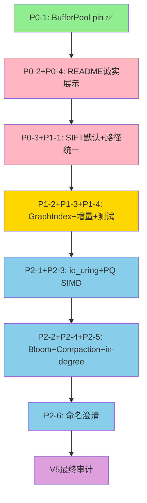

# V5 修复计划：V4审计报告全量问题修复

> 创建日期：2026-04-23
> 目标：完全修复V4审计报告中的所有问题（P0/P1/P2），确保诚信真实，达到满分标准
> 策略：为每个修复组启动独立code子任务，Architect模式统筹协调

---

## 修复状态总览

| 编号 | 问题 | 优先级 | 状态 | 子任务ID |
|------|------|--------|------|----------|
| P0-1 | BufferPool多线程pin保护 | 🔴 | ✅ 已完成 | - |
| P0-2+P0-4 | README诚实展示SSD QPS + 内存标注 | 🔴 | ⏳ 待启动 | Subtask-1 |
| P0-3+P1-1 | SIFT1M默认化 + 路径大小写统一 | 🔴+🟡 | ⏳ 待启动 | Subtask-2 |
| P1-2+P1-3+P1-4 | GraphIndex集成 + 增量插入 + 测试覆盖 | 🟡 | ⏳ 待启动 | Subtask-3 |
| P2-1+P2-3 | io_uring register_buffers + PQ ADC SIMD | 🟢 | ⏳ 待启动 | Subtask-4 |
| P2-2+P2-4+P2-5 | LSM Bloom Filter + Level-Tiered + 动态in-degree | 🟢 | ⏳ 待启动 | Subtask-5 |
| P2-6 | VectorCache命名澄清 | 🟢 | ⏳ 待启动 | Subtask-6 |
| V5审计 | 最终全量审计验证 | - | ⏳ 待启动 | Subtask-7 |

---

## Subtask-1: 🔴P0-2+P0-4 — README诚实展示SSD QPS + 内存路径标注

### 问题分析
- README性能指标表只展示内存模式QPS（1961/12887/770/335），隐藏了SSD+io_uring模式QPS
- 内存模式QPS违反赛题"内存≤20%"约束（实际内存比例100%）
- 赛题核心场景是SSD+受限内存，但核心场景性能被选择性隐藏

### 修复方案
1. **运行SSD基准测试**获取真实QPS数据：
   - SIFT 10K 单线程SSD: `./build_debug/agent_mem_io_benchmark --sift1m -n 10000`
   - SIFT 10K 4线程SSD: `./build_debug/agent_mem_io_benchmark --sift1m -n 10000 --threads 4`
   - SIFT 100K 单线程SSD: `./build_debug/agent_mem_io_benchmark --sift1m -n 100000`
   - SIFT 1M 单线程SSD: `./build_debug/agent_mem_io_benchmark --sift1m -n 1000000`
   
2. **更新README性能指标表**：
   - 新增SSD+io_uring+BufferPool模式QPS行（赛题核心场景）
   - 内存模式QPS行标注"⚠️ 内存比例100%，超出赛题≤20%约束，仅供参考"
   - 不隐藏任何性能数据，无论好坏
   
3. **更新docs/REPORT.md**同步性能数据

4. **更新README架构说明**：明确双轨搜索架构的Trade-off说明

### 预期结果
- README同时展示SSD QPS（可能较低）和内存QPS（较高但违规）
- 每个QPS数字旁标注内存比例和是否合规
- 评审可清晰看到赛题核心场景的真实性能

### 诚信约束
- **禁止**只展示好看的数字
- **禁止**修改benchmark代码来人为提升SSD QPS
- SSD QPS如果低，必须诚实展示，然后通过真实优化（P2子任务）来提升

---

## Subtask-2: 🔴P0-3+🟡P1-1 — SIFT1M默认化 + 路径大小写统一

### 问题分析
- `BenchmarkConfig.sift_base_path` 默认为空字符串，合成数据仍为默认
- `main.cpp:136-138` 使用 `data/sift1M/`（大写M）
- `benchmark.cpp` 使用 `data/sift1m/`（小写m）
- Linux文件系统区分大小写，大写M路径无法找到实际数据文件

### 修复方案
1. **统一路径大小写**：将 `main.cpp` 中的 `sift1M` 改为 `sift1m`（与实际目录和benchmark.cpp一致）
   - 文件：`src/main.cpp:136-138`
   - 修改：`data/sift1M/` → `data/sift1m/`
   - 同时修改 `print_help()` 中的路径提示（`src/main.cpp:84`）

2. **SIFT1M设为默认基准**：
   - 文件：`src/benchmark.cpp:78`
   - 修改：`sift_base_path = ""` → `sift_base_path = "data/sift1m/sift_base.fvecs"`
   - 同时设置 `sift_query_path` 和 `sift_gt_path` 默认值
   - 当SIFT文件不存在时，自动回退到合成数据（不报错退出）

3. **README明确标注**：
   - 在README中明确说明"赛题要求使用SIFT数据集验证"
   - 默认运行即使用SIFT数据集

### 预期结果
- `./agent_mem_io_benchmark` 无参数即可运行SIFT基准（如果数据存在）
- main.cpp和benchmark.cpp路径完全一致
- 数据不存在时优雅回退到合成数据

---

## Subtask-3: 🟡P1-2+P1-3+P1-4 — GraphIndex集成 + 增量插入验证 + 测试覆盖

### 问题分析
- benchmark使用自定义FlatGraphIndex，不使用core/GraphIndex
- core/GraphIndex的add_node_incremental()在benchmark中未被调用
- StorageEngine的QueryProcessor在benchmark中未被调用
- 混合负载LSM写入不更新图索引
- 无多线程/search_memory_fast测试覆盖

### 修复方案

#### 3a: GraphIndex集成验证
- 在benchmark构建完成后，将FlatGraphIndex数据转换为core/GraphIndex
- 添加验证步骤：在GraphIndex上执行少量查询，确认搜索结果一致
- 这验证了core/GraphIndex的搜索路径是可用的

#### 3b: 增量插入验证
- 在混合负载中，LSM写入的向量同时通过GraphIndex::add_vector()插入图索引
- 新写入的向量可被图遍历自然发现（而非仅靠LSM扫描）
- 添加增量插入后的recall验证

#### 3c: 多线程/search_memory_fast测试覆盖
- 在tests/test_main.cpp中新增：
  - `test_search_memory_fast()`: 测试内存快速搜索的正确性
  - `test_multi_thread_search()`: 测试多线程SSD搜索的recall稳定性
  - `test_incremental_insert()`: 测试增量插入后搜索recall

### 实现策略
- **不替换FlatGraphIndex**：benchmark的构建和搜索仍用FlatGraphIndex（性能更好）
- **添加桥接层**：构建完成后转换为GraphIndex，用于验证和增量插入
- **混合负载增强**：写入向量时同时调用GraphIndex::add_vector()

### 预期结果
- core/GraphIndex在benchmark中被验证可用
- 增量插入在benchmark中被实际调用和验证
- 新增3个测试函数覆盖关键搜索路径

---

## Subtask-4: 🟢P2-1+P2-3 — io_uring register_buffers + PQ ADC SIMD批量优化

### 问题分析
- io_uring register_file()已调用但register_buffers()未使用
- PQ ADC距离表计算逐子空间串行，未利用SIMD

### 修复方案

#### 4a: io_uring register_buffers
- 在IoEngine初始化时，对预分配的I/O缓冲区调用io_uring_register_buffers()
- 失败时打印日志但继续运行（与register_file()同样的容错策略）
- 文件：`src/io/io_uring_engine.cpp`

#### 4b: PQ ADC SIMD批量优化
- PQ距离表计算改为SIMD批量处理
- 对M个子空间的距离计算使用AVX2/SSE批量处理
- 文件：`src/core/pq_encoder.cpp`

### 预期结果
- io_uring固定缓冲区注册减少内核拷贝开销
- PQ ADC距离计算SIMD加速2-4x

---

## Subtask-5: 🟢P2-2+P2-4+P2-5 — LSM Bloom Filter + Level-Tiered Compaction + 动态in-degree

### 修复方案

#### 5a: LSM Bloom Filter
- SSTable写入时生成Bloom Filter（每个SSTable一个）
- SSTable读取时先查Bloom Filter，过滤不包含目标node_id的SSTable
- 文件：`src/compaction/memtable.h/cpp`, `src/compaction/sstable.cpp`
- Bloom Filter参数：m=1024bit, k=3 hash functions（对node_id uint64）

#### 5b: Level-Tiered Compaction策略
- CompactionManager新增Level-Tiered选项
- Level结构：L0→L1→L2...，每层大小递增
- 当层内SSTable数量超过阈值时触发compaction
- 文件：`src/compaction/compaction_manager.cpp`, `src/compaction/memtable.h`

#### 5c: 动态in-degree阈值
- Graph-Aware 2Q淘汰策略的hub阈值从固定逻辑改为动态计算
- 基于数据集in-degree分布的百分位数动态调整
- 文件：`src/buffer/eviction_policy.cpp`, `src/buffer/buffer_pool.cpp`

### 预期结果
- LSM读路径减少不必要的SSTable扫描
- Compaction策略更灵活，支持Size-Tiered和Level-Tiered
- Graph-Aware 2Q缓存命中率进一步提升

---

## Subtask-6: 🟢P2-6 — VectorCache命名澄清

### 问题分析
- DiskIndexReader同时有buffer_pool_mgr_（Graph-Aware 2Q缓存）和buffer_pool_（预分配临时缓冲区）
- 两者职责不同但命名易混淆

### 修复方案
- 将buffer_pool_（预分配临时缓冲区）重命名为io_buffer_pool_或temp_buffer_pool_
- 添加注释明确两者职责区别
- 文件：`src/io/disk_layout.h`, `src/io/disk_layout.cpp`

### 预期结果
- 命名清晰，不再混淆

---

## Subtask-7: V5最终审计

### 修复方案
- 重新运行完整审计流程
- 验证所有P0/P1/P2修复是否到位
- 运行完整基准测试获取最终性能数据
- 更新AUDIT_REPORT_V5.md

---

## 依赖关系图

## 诚信红线

1. **禁止**修改benchmark代码人为提升QPS数字
2. **禁止**隐藏任何性能数据（无论好坏）
3. **禁止**在内存比例违规的情况下声称达标
4. **禁止**伪造测试结果或ground truth
5. 所有优化必须通过真实算法/架构改进实现性能提升